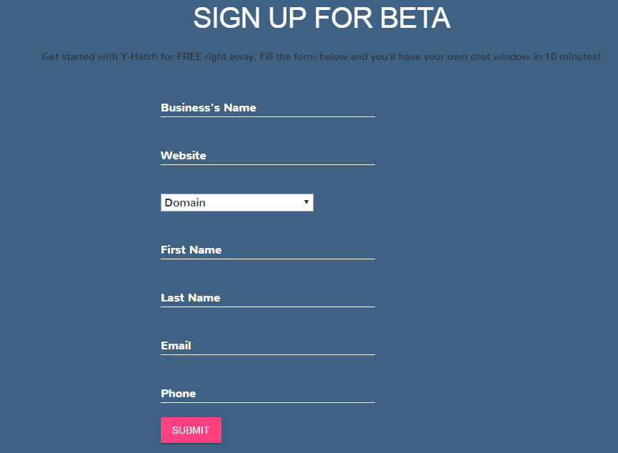

.. yhatch documentation master file, created by
   sphinx-quickstart on Tue May 24 17:09:23 2016.
   You can adapt this file completely to your liking, but it should at least
   contain the root `toctree` directive.

INTRODUCTION
==================================

.. toctree::
   :maxdepth: 6
Thank you for using **Y-Hatch** as an engagement solution for your business. ::

 Y-Hatch is a simple SaaS product that gets embedded in your website (coming soon
 to mobile apps as well) and allows your visitors to concurrently chat with each 
 other and help each other out with the queries they have.

The possibilities are endless. Users trust fellow users the most when it comes to a recommendation. You can have your brand ambassadors representing you , providing expertise, and you can even have customer support reps assisting with specifics.  The whole idea is engage your visitors better , faster , provide them with valuable advice from brand ambassadors (Y-ACES ) , and grow your community.

In this section, you will learn how to get started with Y-Hatch.  There are 3 crucial segments :

Client Dashboard
--------------------
The Y-Hatch ``Client Dashboard`` is your home-base. This is your Admin Dashboard section where , upon logging in, you will be seeing the analytics activity of all that has happened on your chat window on your site. You will be able to copy/download the various tables to spreadsheets for your own analysis. You can also control your chat visual settings from here. 

Chat 
--------------------
The ``Chat Window`` is the soul of our product. Once the code is embedded on your website (we will tell you how), the chat window will appear on the bottom right of your website. You website visitors can potentially start chatting with others right from this window. 

Y-ACES Dashboard
--------------------
The ``Y-ACES dashboard`` is a dashboard created exclusively for your high engaging visitors. Once your visitors or users begin asking questions, answering questions, upvoting  and much more, they are awarded points. Once they cross 100 points, they have exclusive access to their ``Y-ACES dashboard`` with their regular login .The Dashboard gives a single point of access to the engaged users. ::

	A mobile app for Y-ACES Dashboard is coming soon.

The ACES can access the dashboard directly from a ACES mobile app, get notifications on it and also respond to questions they are interested in. Notifications are sent based on user interests that are being followed.

CONFIGURATION
==================
We will show you how you can implement Y-Hatch in a matter of 5 minutes on your business website.

.. toctree::
   :maxdepth: 6

Sign Up
-------------------
The first step for installing Y-Hatch in your business website is to sign up. Visit `Y-Hatch <http://yhatch.com>`_ and sign up. It is imperative that you put in the correct information here. Here is what you will see:

1. Business Name : Enter the name of your website
#. Website : Enter the website address (Eg. www.yhatch.com) . Ensure that this is accurage.
#. Domain : Drop down and select the domain that your business falls under.
#. First name : Enter your first name.
#. Last Name : Enter your last name.
#. Email :  Enter your email address. Ensure this is accurate. This is where you will be sent an email for ``password confirmation`` and ``login details`` for your account.
#. Phone : Enter your accurate telephone number.  Preface it with your ``country code``.

Upon clicking on the ``SUBMIT`` button,  an email will be triggered to your registered email account. Do keep a look out in the bulk and junk folders as well as sometimes emails tend to land up there.  

Check your email and follow the instructions from there. You will be directed to the ``Y-Hatch Client Dashboard`` . Set a secure password and then proceed to log in.
You now have access to the client dashboard.
   
Client Dashboard 
-------------------

Chat Window on your website
-------------------
Implementing the Y-Hatch chat window on your website is very simple.  The chat window is extremely light-weight and simple, and it will not add any noticeable loading time to your website.

Prior to the embedding the following code, please work with a your tech team and ensure you have backed up all your crucial files.  Now, proceed to your main index file (eg. index.php) and in the scripts section at the top, simply copy and paste the following and save.

.. code-block:: js
    :linenos:

    
	
	

Reload your website and you should now see the y-hatch Chat window at the bottom left. In case, you do not see it, please contact us immediately.

FAQ
==================

What is the y.Hatch Chat window?
----------------------------------
The y.Hatch chat window is a window that can be embedded on your website (and soon, integrated with your mobile app) where visitors to your website can concurrently chat with each other (and any of your representatives who may be online at the moment!). This allow visitors to quickly gain feedback about a product or service query that they may have. 

How do I implement it?
----------------------------------
The implementation steps are super simple and takes less than 5 minutes. These are explained in the earlier section. Check it out!

How do my website visitors see it?
-----------------------------------
Once the y.Hatch code is successfully implemented on your website, it will typically appear on the bottom right of your website as a chat bubble that says "Chat with other visitors/ See what others are saying". Once the visitor clicks on it, it opens up on the right side and displays the public chat room.

Can all my visitors chat from it?
-----------------------------------
Yes! All visitors who are present on your website at that moment in time can chat  on it!

Do visitors need to sign up before chatting?
-----------------------------------------------
Not really!  They can simply ask a question and get started by entering a Nickname!

What kind of questions can a user ask?
-----------------------------------
Any kind of question really! It might be do to with a product that they like and want to get opinions from fellow visitors about. Or it could be about a service. They might even have a support related question, in which case it is a great idea to always have a support representative as part of the chat room at all times :-).

What is a poll? How can a poll be set-up?
----------------------------------
Imagine a visitor who is trying to make up her mind between 2 tops , and wants a group opinion! All she has to do is create a poll which gets posted instantly on the room, and allows people to upvote their choices!  This way, she can get a crowdsourced decision made!

Setting up  a poll is simple. There's a button called POLL in the chat box . A user has to simply click on it, ask the question (eg. " Which top do you guys think rocks?" )  , paste the 2 product option URLs on each of the option fields, and submit!   As simple as that, and the poll gets published for others to view and vote.

How do people vote on a poll?
-------------------------------
Once the poll is published, the voting is simple. A user simply has to click on the upvote button  (denoted by a "HEART" icon) to cast in their vote. 1 user is limited to 1 vote.  Voting is currently restricted to only signed in users.

Do the options on a poll necessarily have to be a product page URL?
-----------------------
Not at all. A user can also put in free text . For example, a user on a travel portal may have a question " Which is a better destination for September?" And the options could be free text fields and he could enter " Bali" and "Maldives" as the 2 options.

How many options can a user enter for a poll?
----------------------------
Currently, a user can enter upto 4 options for a poll.

How do you upvote a someone's comment or reply?
----------------------------
A user can upvote another question or comment by simply clicking the upvote button (denoted by a "HEART" symbol).  The upvote is currently restricted to signed in users only . 1 user is limited to 1 upvote per comment/question.

How can one reply to a question posted on the main chat room?
--------------------------------------
To reply to a question /poll posted , a user simply has to click on the COMMENT bubble on the right  and respond directly to it. All responses get threaded within.

Are users allowed to report a comment they find offensive or inappropriate?
--------------------------
Yes they can.  For every comment posted on the main chat room or in the reply section, there is a Flag button (depicted with an "Exclamation" image) that a user can click. Upon clicking, he or she can choose the reason as to why it is inappropriate .

Once reported, you will see this comment on your Client Dashboard.  All you need to do is ACCEPT the Flag (if you want to remove the respective Flagged comment from the Chat window) or REJECT it (if you want to allow the comment). If you ACCEPT the flag, it will automatically disappear from the Chat Window.  This ensures that moderation is managed.  

ACES-DASHBOARD FAQ
------------------

This covers the documentation for the ACES DASHBOARD . 

''this is how you write a love song''
`this is a link<yhatch.com>`_
``this is verbatim``
**bold**
*italics*

.. code-block:: js
    :linenos:

    
	
	
Embedding code:: 
   
    
	

	
Contact
===================

The best way to get in touch with us is by email! Just shoot us one at admin@yhatch.com and we promise to get back to you within 24 business hours.  You can also call us at +91 9900 354400 for any queries (M-F, 9am to 6pm).

ADMIN LOGIN
**************

